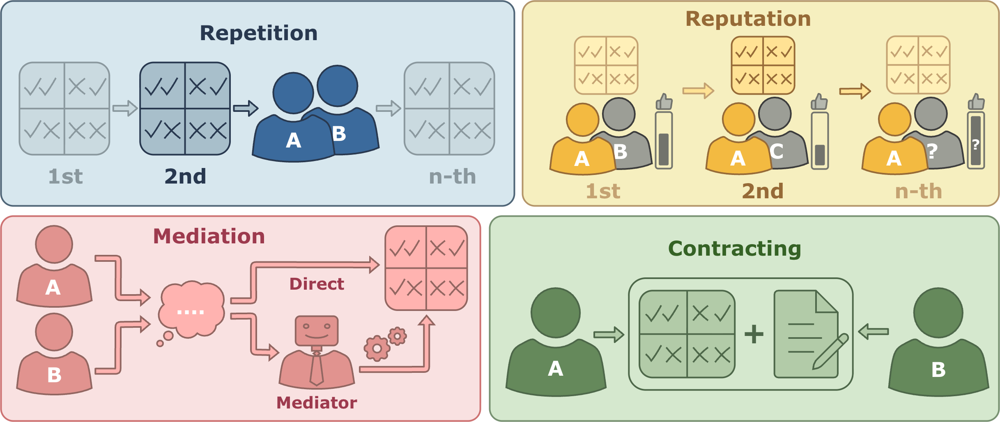

# CoopEval: Benchmarking Cooperation-Sustaining Mechanisms and LLM Agents in Social Dilemmas

[](https://arxiv.org/abs/2604.15267)

This repository contains the official implementation for the paper **"CoopEval: Benchmarking Cooperation-Sustaining Mechanisms and LLM Agents in Social Dilemmas"**.

It serves as a research framework for simulating societies of Large Language Model (LLM) agents interacting in mixed-motive games. The codebase enables the evaluation of how game-theoretic mechanisms—such as repetition, reputation, mediation, and contracts—can enforce cooperation among selfish, rational agents.

<p align="center">
  
</p>

<p align="center">
  <em>Overview of the cooperation-sustaining mechanisms evaluated in CoopEval.</em>
</p>

---

## 📂 Project Overview

- **Social Dilemmas:** Evaluate agents across six mixed-motive benchmarks—**Prisoner’s Dilemma**, **Traveler’s Dilemma**, **Public Goods**, **Trust Game**, Stag Hunt, and Matching Pennies.
- **Mechanism Stack:** Toggle the baseline `No Mechanism` alongside Repetition, Reputation, Mediation, and Contracting to isolate how enforcement tools change incentives.
- **LLM Agent Benchmarks:** Mix API-hosted and local personas configured under `configs/agents/` to compare reasoning styles, safety guardrails, and latency/cost trade-offs.
- **Experiment & Analysis Workflow:** Compose experiments with modular YAML, launch runs via `scripts/experiments`, and feed the resulting traces into the bundled judges and visualization utilities for post-hoc analysis.

---

## 🛠️ Installation

The codebase requires **Python 3.12**.

```bash
# Create a virtual environment
python3 -m venv .venv
source .venv/bin/activate  # On Windows use: .venv\Scripts\activate

# Install the package
pip install --upgrade pip
pip install -e .

# If you want developer tools as well (black, isort, ruff, ipykernel)
pip install -e ".[dev]"
```

If you plan to run local Hugging Face checkpoints, ensure your environment can access the weights (set `MODEL_WEIGHTS_DIR` in `config.py` if necessary).

---

## 🔑 API Configuration

This framework supports multiple LLM providers. You must provide API keys using either a `.env` file (recommended) or by exporting environment variables.

Create a file named `.env` in the root directory:

```bash
OPENAI_API_KEY=your_openai_key_here
GEMINI_API_KEY=your_gemini_key_here
OPENROUTER_API_KEY=your_openrouter_key_here
```

---

## 🚀 Quick Start

To reproduce the main results, you can either run a single custom experiment or use the batch runner.

### Run a Single Experiment

Pick the modular components you want to combine—everything under `configs/` is swappable, so start with the shipped YAMLs or drop your own.

1. Choose component files:
   - `configs/games/*.yaml` for the dilemma (e.g., `games/prisoners_dilemma.yaml`, `games/public_goods.yaml`, `games/matching_pennies.yaml`).
   - `configs/mechanisms/*.yaml` for the enforcement setting (`mechanisms/no_mechanism.yaml`, `mechanisms/repetition.yaml`, etc.).
   - `configs/agents/*.yaml` for the roster (`agents/test_agents_6.yaml`, `agents/few_strong_llms.yaml`, ...).
   - `configs/evaluation/*.yaml` for downstream scoring (e.g., `evaluation/no_deviation_ratings.yaml`).
   If you need a custom model, game, or mechanism, copy one of these YAMLs, edit it in place, and keep it under the corresponding folder.
2. Create a tiny experiment stub that just references the component paths you selected (save it anywhere under `configs/`, e.g., `configs/quick_start.yaml`):

```yaml
# configs/quick_start.yaml
game_config: "games/prisoners_dilemma.yaml"
mechanism_config: "mechanisms/repetition.yaml"
agents_config: "agents/test_agents_6.yaml"
evaluation_config: "evaluation/no_deviation_ratings.yaml"
name: "quick_start"
concurrency:
  max_workers: 4
  tournament_workers: 1
```

3. Run the experiment script:

```bash
python scripts/experiments/run_experiment.py --config configs/quick_start.yaml --output-dir outputs/
```

---

## 🧪 Post-hoc Justification Judging

Use the justification-judge adapter (backed by the bundled
`coopeval.llm_judge` package):

```bash
python scripts/llm_judge/run_justification_judge.py \
  data/clean/run3 \
  --provider OpenAI \
  --model-name gpt-4o-mini \
  --output-name gpt-4o-mini_judge_run1
```

Notes:

- Outputs are written under `outputs/judge/<output-name>/raw/`; you must provide
  `--output-name` (without extension) to control the slug. Raw files land in
  `outputs/judge/<output-name>/raw/` as `judgement.jsonl` and
  `judgement_summary.json`, and the script prints those exact paths for use in
  downstream tools.
- Default filters target explanation-rich decisions (`--agent-type cot` and
  `--min-response-chars 80`).
- Use `--max-workers N` to enable parallel judging API calls.
- The script is resumable: if output already exists, it skips previously judged
  `trace_id` rows unless `--overwrite` is set.
- A summary JSON is generated next to the raw JSONL.

---

## 📊 Visualization Reference

All taxonomy/mechanism plotting commands (radar, heatmap, Sankey, etc.) now take
only a `run_name` and auto-discover the necessary artifacts under
`outputs/judge/<run_name>/`. See
[`scripts/llm_judge/plotting/README.md`](scripts/llm_judge/plotting/README.md)
for the one-liner invocation guide and optional flags.

---

## ⚙️ Configuration Glossary

### Supported Games (`src/coopeval/games/`)

| Class | Description |
| :--- | :--- |
| `PrisonersDilemma` | Two-player PD with configurable payoff matrix. |
| `PublicGoods` | N-player contribution game with multiplier $\alpha$ and redistribution. |
| `TravellersDilemma` | Two-player race-to-the-bottom parameterised by claims $\{2..k\}$. |
| `TrustGame` | Two-player sequential investment and return game. |

### Supported Mechanisms (`src/coopeval/mechanisms/`)

| Class | Description |
| :--- | :--- |
| `NoMechanism` | Single-shot baseline. |
| `Repetition` | Repeated interactions with the same partner (grim trigger capable). |
| `Reputation` | Interactions with changing partners; visible history (first or higher-order). |
| `Mediation` | Agents propose and vote on a mediator delegate. |
| `Contracting` | Agents propose and sign binding payoff-transfer contracts. |

---

## 🧠 Code Structure

```text
.
├── configs/                # YAML experiment definitions (games, mechanisms, agents, evals)
├── data/                   # Source traces + cleaned datasets consumed by judges
├── notebooks/              # Exploratory analysis notebooks
├── outputs/                # Artifacts from experiments & judges (raw/normalized/dataset/figures)
├── scripts/
│   ├── batch_utils.sh      # Shell helpers for launching sweeps on clusters/local
│   ├── experiments/        # Run + batch orchestration entrypoints (run_experiment, run_batch, etc.)
│   ├── llm_judge/          # Judging/reporting CLIs (judge runs, normalization, report, exporters, plotting)
│   │   └── plotting/       # Visualization scripts (heatmaps, radar, scatter, Sankey, etc.)
│   ├── analysis/           # Analysis plotting entrypoints (action frequencies, dynamics, design quality)
│   └── tests/              # Smoke-test / resume scripts used during development
├── src/coopeval/
│   ├── analysis/           # Reusable post-hoc analysis routines and metrics
│   ├── agents/             # Agent definitions, personas, and API client integrations
│   ├── games/              # Social dilemma environments (PD, PGG, Trust, Traveler's, etc.)
│   ├── llm_judge/          # In-package judge processors, datasets, plotting utilities
│   ├── mechanisms/         # Cooperation mechanisms (Repetition, Reputation, Contracts, Mediation)
│   ├── ranking_evaluations/# Replicator dynamics + tournament scoring utilities
│   ├── registry/           # Config registries and dynamic loader helpers
│   ├── script_utils/       # Shared utilities for scripts, plotting exports, and report colors
│   ├── utils/              # Shared helpers (async, logging, math, IO)
│   └── visualization/      # Shared visualization primitives
└── pyproject.toml          # Package metadata, dependencies, and tool configuration
```

---

## Citation

If you use CoopEval in your work, please cite:

```bibtex
@misc{tewolde2026coopeval,
      title={CoopEval: Benchmarking Cooperation-Sustaining Mechanisms and LLM Agents in Social Dilemmas},
      author={Emanuel Tewolde and Xiao Zhang and David Guzman Piedrahita and Vincent Conitzer and Zhijing Jin},
      year={2026},
      eprint={2604.15267},
      archivePrefix={arXiv},
      primaryClass={cs.GT},
      url={https://arxiv.org/abs/2604.15267},
}
```
